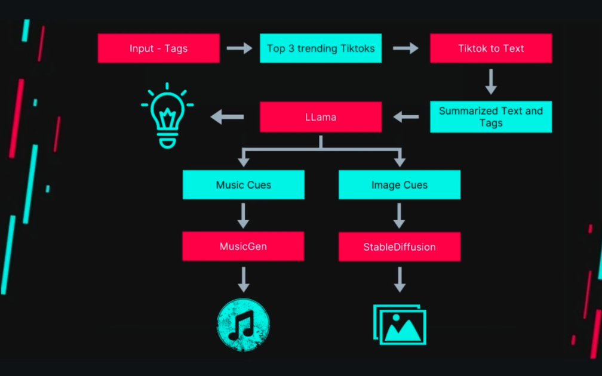

# TrendTok Studio

A comprehensive AI-powered content creation platform that analyzes trending videos, extracts insights, and generates new content ideas with AI-generated music and images. Built with Flask, multiple machine learning models, and modern web technologies.



## Architecture Overview

TrendTok Studio follows a modular microservice-like architecture where each component handles a specific aspect of the content generation pipeline:

```
┌─────────────────┐    ┌─────────────────┐    ┌─────────────────┐
│   Frontend      │    │   Flask App     │    │   AI Services   │
│                 │    │                 │    │                 │
│ • HTML/CSS/JS   │◄──►│ • Route Handler │◄──►│ • Text Analysis │
│ • Bootstrap UI  │    │ • Session Mgmt  │    │ • Music Gen     │
│ • Tag Interface │    │ • File Handling │    │ • Image Gen     │
└─────────────────┘    └─────────────────┘    └─────────────────┘
                                ▲
                                │
                       ┌─────────────────┐
                       │  Data Sources   │
                       │                 │
                       │ • Video Downloads│
                       │ • Speech-to-Text│
                       │ • OCR Processing│
                       └─────────────────┘
```

## Core Components

### 1. Web Application Layer (`app.py`)
- **Framework**: Flask with Bootstrap integration
- **Purpose**: Main application server handling HTTP requests and responses
- **Key Features**:
  - Session management for user state
  - File upload and processing coordination
  - API endpoint management
  - Static file serving for generated content

### 2. Video Processing Pipeline (`tiktok_videos/`, `tiktok_to_text/`)

#### Video Download System
- **Technology**: Google Drive API integration with `gdown`
- **Process**: 
  - Authenticates using service account credentials
  - Fetches videos from categorized Google Drive folders
  - Downloads up to 3 videos per tag/category
- **Data Structure**: Pre-organized folders for different content categories

#### Audio Transcription
- **Primary Method**: Google Speech Recognition API
- **Process Flow**:
  1. Extract audio from video using `moviepy`
  2. Convert to WAV format for processing
  3. Transcribe speech using Google's cloud service
  4. Clean up temporary audio files

#### Parallel Processing
- **Implementation**: ThreadPoolExecutor for concurrent video processing
- **Benefit**: Significantly reduces processing time for multiple videos
- **Error Handling**: Graceful degradation if individual videos fail

### 3. Text Analysis System (`summariser/`)

#### LLM Integration
- **Model**: Llama3-8B via LlamaAPI
- **Purpose**: 
  - Summarize transcribed content (80 words max)
  - Extract relevant tags and keywords
  - Generate coherent content themes

#### Processing Pipeline
1. **Input**: Combined transcriptions from all videos
2. **Summarization**: AI-powered text condensation
3. **Tag Extraction**: Keyword identification for content themes
4. **Output**: Structured data with summary and tags

### 4. Content Generation Services

#### Music Generation (`music_gen/`)
- **Model**: Facebook's MusicGen (Small variant)
- **Technology**: Hugging Face Transformers
- **Process**:
  - Takes text description as input
  - Generates audio samples using conditional generation
  - Outputs WAV files with configurable length (5-second increments)
- **Hardware Optimization**: Uses available GPU acceleration (CUDA/MPS/CPU fallback)

#### Image Generation (`animate_text/`)
- **Model**: Stable Diffusion v1.5
- **Technology**: Diffusers pipeline
- **Features**:
  - Text-to-image generation
  - Memory optimization with attention slicing
  - Multi-device support (CUDA/MPS/CPU)

### 5. Device Acceleration System (`utils.py`)
- **Purpose**: Automatic hardware detection and optimization
- **Priority Order**: CUDA → Apple Metal (MPS) → CPU
- **Implementation**: Dynamic device selection for optimal performance

## Technology Stack Rationale

### Backend Choices

**Flask Framework**
- Chosen for simplicity and rapid prototyping
- Lightweight compared to Django for this use case
- Excellent integration with Python ML libraries
- Easy to deploy and scale horizontally

**Python as Primary Language**
- Dominant language in ML/AI ecosystem
- Extensive library support for multimedia processing
- Strong community and documentation
- Seamless integration between web and AI components

### AI Model Selection

**LlamaAPI (Remote)**
- Provides access to powerful LLM without local compute requirements
- Cost-effective for text processing workloads
- Handles complex summarization and extraction tasks
- API-based scaling without infrastructure management

**MusicGen Small (Local)**
- Balances quality with computational requirements
- Facebook's proven model for audio generation
- Runs efficiently on consumer hardware
- Offline capability after initial download

**Stable Diffusion v1.5 (Local)**
- Industry-standard image generation
- Well-optimized for various hardware configurations
- Large community and extensive fine-tuning options
- Reasonable resource requirements with attention slicing

### Data Processing Libraries

**MoviePy**: Video/audio manipulation
- Pure Python implementation
- Handles multiple video formats
- Simple API for audio extraction

**SpeechRecognition**: Audio transcription
- Wrapper for multiple speech services
- Google Speech API for accuracy
- Fallback options available

**Transformers**: ML model interfaces
- Hugging Face ecosystem integration
- Standardized model loading and inference
- Automatic hardware optimization

## Setup and Configuration

### Prerequisites
- Python 3.8+
- Sufficient disk space for model downloads (5-10GB)
- Optional: CUDA-compatible GPU for acceleration

### Environment Configuration

1. **Clone and Setup**
```bash
git clone <repository-url>
cd trendtok-studio
python -m venv venv
source venv/bin/activate  # On Windows: venv\Scripts\activate
pip install -r requirements.txt
```

2. **Environment Variables**
Copy `.env.example` to `.env` and configure:
```bash
LLAMA_API_KEY=your_llama_api_key_here
GOOGLE_SERVICE_ACCOUNT_FILE=path/to/service_account.json
FLASK_SECRET_KEY=your_secure_random_key_here
```

3. **Google Drive Setup**
- Create a Google Cloud Project
- Enable Google Drive API
- Create a service account and download JSON credentials
- Share your video folders with the service account email
- Update folder IDs in `tiktok_videos/download.py`

4. **Model Initialization**
```bash
python init.py  # Pre-downloads and caches ML models
```

### Production Deployment

**Docker Configuration**
```bash
docker build -t trendtok-studio .
docker run -p 8888:8888 --env-file .env trendtok-studio
```

**Environment Considerations**
- Models require 4-8GB RAM depending on concurrent usage
- GPU acceleration recommended for image generation
- Consider model caching strategies for faster startup

## API Endpoints and Data Flow

### Primary Workflow
```
POST /search
├── Parse form data (tags)
├── Download videos (Google Drive)
├── Extract and transcribe audio
├── Summarize content (LlamaAPI)
├── Generate music (MusicGen)
├── Create images (Stable Diffusion)
└── Return results (JSON)
```

### Data Structures
```python
# Input
{
  "tags": ["AI", "MachineLearning", "TechInnovation"]
}

# Output
{
  "summary": "80-word content summary...",
  "tags": "extracted, keywords, themes",
  "music_url": "/static/generated_music.wav",
  "image_url": "/static/generated_image.png"
}
```

## Performance Optimizations

### Concurrency
- Parallel video processing with ThreadPoolExecutor
- Asynchronous model loading where possible
- Efficient memory management for large models

### Resource Management
- Model caching to avoid repeated downloads
- Attention slicing for memory-constrained environments
- Automatic device selection for optimal performance

### Scalability Considerations
- Stateless design enables horizontal scaling
- External API usage (LlamaAPI) reduces compute requirements
- Docker containerization for consistent deployments

## Security Features

- Environment variable configuration for sensitive data
- Service account-based Google API authentication
- Session-based user state management
- File upload validation and sanitization

## Development Workflow

1. **Local Development**: Use `.env` file for configuration
2. **Testing**: Individual module testing before integration
3. **Staging**: Docker environment matching production
4. **Production**: Cloud deployment with proper secrets management

This architecture enables developers to understand, modify, and extend the system while maintaining separation of concerns and scalability.

## Reference

Inspired from https://github.com/srivarshan-s/TikTok-Trend-Fusion